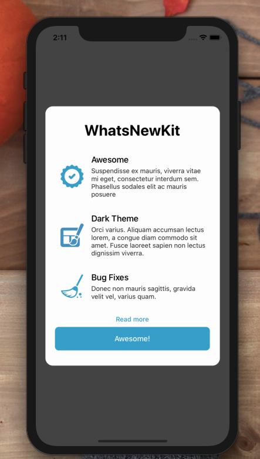

[](https://github.com/WrathChaos/react-native-whatsnew-kit)

[](https://github.com/WrathChaos/react-native-whatsnew-kit)

[](https://www.npmjs.com/package/react-native-whatsnew-kit)
[](https://www.npmjs.com/package/react-native-whatsnew-kit)

[](https://opensource.org/licenses/MIT)
[](https://github.com/prettier/prettier)

<p align="center">
  
</p>

# Installation

Add the dependency:

```js
npm i react-native-whatsnew-kit
```

## Peer Dependencies

###### IMPORTANT! You need install them

```js
"react": ">= 16.x.x",
"react-native": ">= 0.55.x",
"react-native-modal": ">= 11.5.3"
```

# Usage

## Import

```js
import WhatsNew from "react-native-whatsnew-kit";
```

## Basic Usage

```jsx
<WhatsNew data={data} isVisible={isVisible} ImageComponent={FastImage} onBackdropPress={() => setIsVisible(false)} />
```

## Data Array Format

Data **MUST** be with this format. If you want to use your own iconComponent instead of internal **Image** or **ImageComponent** (just as FastImage) then you need to set `iconComponent` field within the data format.

```js
[
  {
    title: "Awesome",
    description:
      "Suspendisse ex mauris, viverra vitae mi eget, consectetur interdum sem. Phasellus sodales elit ac mauris posuere",
    icon: require("assets/check.png"),
    iconComponent: null
  },
  {
    title: "Dark Theme",
    description:
      "Orci varius. Aliquam accumsan lectus lorem, a congue diam commodo sit amet. Fusce laoreet sapien non lectus dignissim viverra.",
    icon: require("assets/theme.png"),
    iconComponent: null
  },
  {
    title: "Bug Fixes",
    description: "Donec non mauris sagittis, gravida velit vel, varius quam.",
    icon: require("assets/wiping.png"),
    iconComponent: null
  }
];
```

# Configuration - Props

| Property              |     Type      |   Default   | Description                                                 |
| --------------------- | :-----------: | :---------: | ----------------------------------------------------------- |
| data                  | Object Array  |     []      | You must set the formatted data as expected                 |
| width                 | number/string |  undefined  | change the width of the whole modal                         |
| height                | number/string |  undefined  | change the height of the whole modal                        |
| title                 |    string     | WhatsNewKit | change the main title                                       |
| onPress               |   function    |  undefined  | set your own function for the main button                   |
| isVisible             |    boolean    |    false    | Visibility of the WhatsNewKit Modal                         |
| fullScreen            |    boolean    |    false    | make the WhatsNewKit full screen                            |
| ImageComponent        |   Component   |    Image    | set your own image component such as FastImage              |
| backgroundColor       |     color     |   #fdfdfd   | change the WhatsNewKit's background color                   |
| iconWidth             | string/number |     50      | change the each icon's width                                |
| iconHeight            | string/number |     50      | change the each icon's height                               |
| buttonText            |    string     |  Awesome!   | set the main button's text                                  |
| buttonStyle           |     style     |   default   | set your own style for main button                          |
| titleFontSize         |    number     |     32      | change the title's font size                                |
| buttonFontSize        |    number     |     16      | change the button's font size                               |
| titleFontColor        |     color     |    #000     | change the title's font color                               |
| titleTextStyle        |     style     |   default   | set your own text style for title                           |
| buttonTextStyle       |     style     |   default   | set your own text style for button                          |
| buttonFontColor       |     color     |   #fdfdfd   | change the button's font color                              |
| textButtonValue       |    string     |  Read more  | change the text button's text                               |
| textButtonOnPress     |   function    |  undefined  | set your own function for text button as `Read more` button |
| itemDescTextStyle     |     style     |   default   | set your own text style for item's description              |
| itemTitleTextStyle    |     style     |   default   | set your own text style for item's title                    |
| textButtonTextStyle   |     style     |   default   | set your own text style for text button's text              |
| textButtonFontColor   |     color     |   #3da7d2   | change the color of text button's font                      |
| buttonBackgroundColor |     color     |   #3da7d2   | change the color of main button's background color          |

## Future Plans

- [x] ~~LICENSE~~
- [ ] Animations
- [ ] Write an article about the lib on Medium


## Credits

WhatsNewKit is heavily inspired by [SvenTiigi's WhatsNewKit](https://github.com/SvenTiigi/WhatsNewKit) Thank you so much for this awesome kit 🥳

## Author

FreakyCoder, kurayogun@gmail.com

## License

React Native WhatsNewKit is available under the MIT license. See the LICENSE file for more info.
